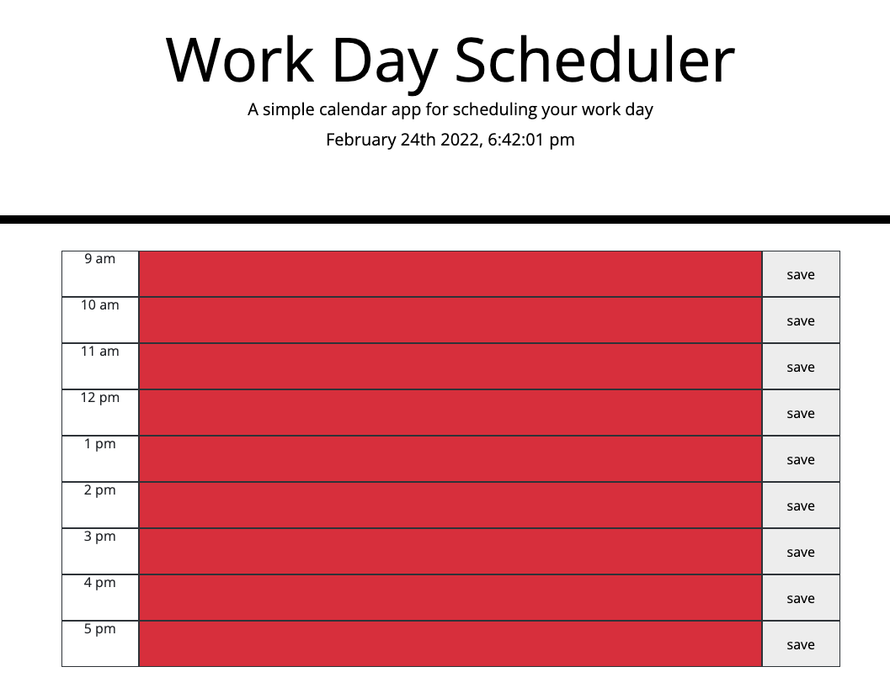

# Work Day Scheduler

## Description
This is an app that allows users to track their daily activities, meetings, appointments, etc. 

It alerts users when their appointments have passed, when they're upcoming, and when they're imminent.

## Technologies
* javascript
* css/bootstrap
* jquery
* moment.js

## Contributors
* Adam Burpee: [github](https://github.com/aburpee/assignment-5-third-party-apis)

## Link
https://aburpee.github.io/assignment-5-third-party-apis/